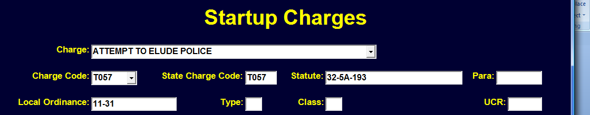
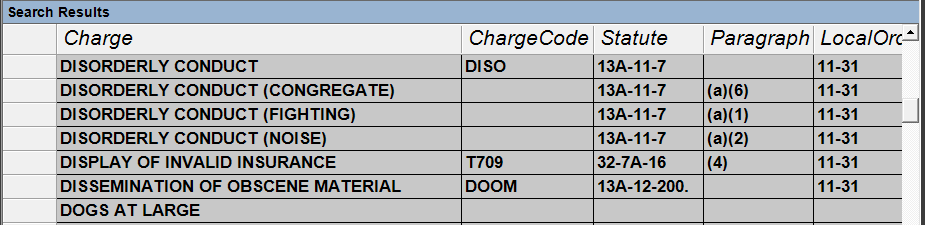
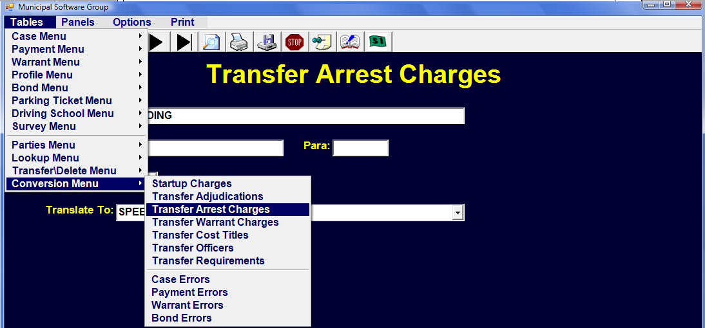
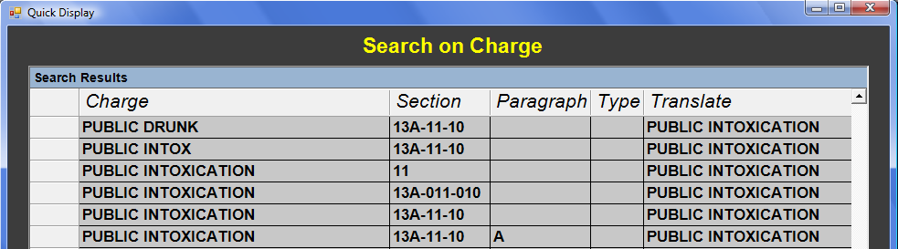

# Data Conversion

## Charges

Converting Data from an older program can be challenging.  This section's focus is on converting the Charges coming from both 'Cases' and 'Warrants'.

The old charges may have different spellings, statute numbers and ordinance numbers.  All combinations of charges and numbers need to be converted to the new charges and numbers.  Before mapping the old to the new we need to firmly establish what the new Charges are to be.  This should be completed in the 'Startup Charges' Table under the Conversion Menu.  Each time the conversion routines are run, 'Startup Charges' is copied into the regular 'Charges' table.  For this reason, no changes should be made to the regular 'Charges' table until after the final conversion.  Instead 'Startup Charges' should be set to exactly the charges to which you want to convert.

## Startup Charges

The 'Charge' field is used to identify this charge and must be unique.  It is a DROP DOWN from the 'State Charges' Table.  You do not, however, have
to use the State Charge wording.  Unlike most DROP DOWN fields you may type what you want in this field without an error.   If this is a State Charge, you should use the 'Charge Code' from that charge even if you don't use the wording.   Normally the 'Charge Code' field and the 'State Charge Code' will be the same.  The Statute would come from the appropriate title (32, 13A, etc) with the appropriate paragraph if needed.  

  

If this is a local charge (not state) the ordinance number should be placed in the'Local Ordinance' field. If this is a state statute, your adopting ordinance number should be placed in 'Local Ordinance'.   A local charge would not have a 'Charge Code', 'State Charge Code',  'Statute' or 'Paragraph'.  All charges must have the 'Charge' wording and a number in 'Local Ordinance'.

## Unique Charge

A point to repeat is that the Charge wording must be unique.  Thus, if you have 4 types of DISORDERLY CONDUCT with different paragraphs you need to find some way to distinguish them from each other. For Example:

  

It is very important that your 'Startup Charges' be accurate and decided upon before proceeding to translating the original charges.

## Transfer Arrest Charges

After the first phase of conversion routines run, the original charges are placed in the 'Transfer Arrest Charges' table.  Likewise, the charges from the original 'Warrants' are placed in the 'Transfer Warrant Charges' located in the 'Conversion Menu'.

  

The 'Transfer Arrest Charges' will contain every DISTINCT combination of Charge, Section, Paragraph, and Type from the old data. You may have many different versions of the same charge with only subtle differences.  The transfer routines need to know how to translate each combination.

  

Notice that the difference may be in the 'Charge' field or an added 0 in the 'Section' field or a 'Paragraph'. Each one needs to be translated to a record in your 'Startup Charges' Table.  This is why it is so important that 'Startup Charges' is perfected before proceeding to 'Transfer Charges'.

  

Every record in the 'Transfer Arrest Charges' table should have an entry in the 'Translate To' field.   You should only edit the 'Translate To' field and not touch the fields above from the original data.

## Warrant Charges

In the same manner the charges from the original Warrants need to be translated to charges in the 'Startup Charges'.