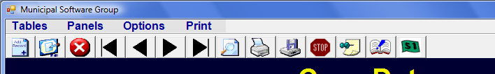
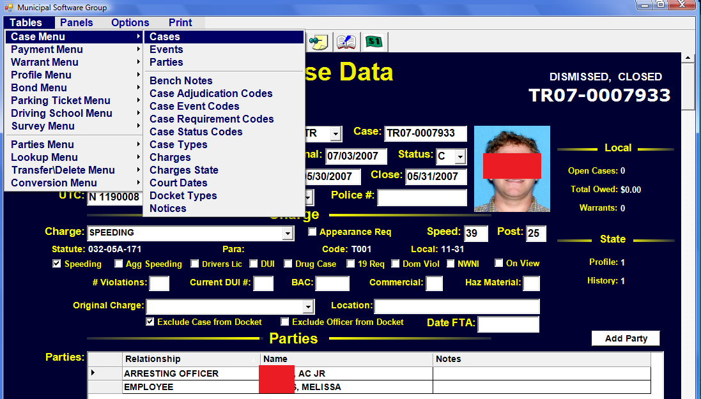

# Getting Started

If you are new to our Court Manager software you will benefit from the information on this page which covers general terminology, keyboard shortcuts (or keystrokes), and navigation of the program.

## Terminology

How about a few (yawn) definitions so that you will know whats being talked about?

***Application***  
The actual software running on your computer. Also referred to as an 'app' or 'program'. The icon you click on your screen 'launches' or starts running the  application on your computer.

***SQL***  
The type of database used to store all your records. SQL stands for Structured Query Language and is often referred to as 'Sequel'.  
The data is stored on a SQL Server (either on your computer if it is not on a network or on a Network Server). On many of the report screens you will see the SQL language. It often starts with 'SELECT * FROM...'

***FOCUS***  
It is the point on the screen that currently has the attention of the computer. If a data entry field has the focus, typing on the keyboard will put the characters in that field. If a screen or data entry field has the focus, it signified in some way (Color Red or Blue) so that you, the user, knows where you are on the screen. 

***TOOL BAR***  
A long, horizontal bar near the top of the Main Screen that contains icons that may be clicked on to perform certain tasks.

***TOOL TIPS***  
Small help words that appear when placing (not clicking) the mouse over certain Data Fields or icons. Used to help identify the name of the the icon or data field and its intended use.

***STATUS BAR***  
the horizontal bar across the bottom of the screen that simply informs the status of certain items such as the current Table Name, Number of Records in the Table, Current Date, etc.

***INFORMATION LINE***  
the horizontal line across the bottom that provides certain information about what is happening. If the line turns red, an error has occurred. The idea is to be less intrusive with the errors and information so that you don't have to take the extra step of clicking on an error box every time.

***CURSOR***  
the flashing line or box that shows exactly where you are typing.

***BROWSE MODE*** 
 You are just looking at Data. The focus is not on the data part of the screen. You are not adding or editing data. 

***EDIT MODE*** 
Changing data on a record that was previously created. If you ESC (or abort) while in this mode, the record will go back to its original data.

***ADD MODE*** 
 Creating a record that was not previously there. ESC will abort the new record and it will not be saved.

## Field Types

Fields are used to display or receive data. The kind of data received and the error checking that goes on depends on the type of field. While check boxes, buttons, etc. are not technically fields, they also are included here.

***FREE FORM FIELD***  
a data field in which anything may be typed. There is no error checking.  

***DATE FIELD*** 
A field that must either be blank or contain a valid Date.

Dates may be entered either with Year First dashes (2008-01-01) or Month/Day/Year slashes (1/1/2008 or 1/1/08). If the year is omitted, the current year is assumed. "2/25" would produce "02/25/2008". Likewise, if both the month and the year are omitted, the current month and year are used to format. "5" would produce "2/5/2008". Just the letter 'T' placed in the date field will put in Today's date.  becomes 

***DROP DOWN FIELD***  
A field that is attached to a lookup table and has a down arrow button to the right. Anything entered in this field must be in the corresponding look up table or an error is generated. You may view the drop down list by clicking on the down arrow box or by pressing the F4 key. The Up/Down arrow keys may be used to highlight data and then the Enter Key to select data.

Clicking on the right arrow or typing Ctrl-B will allow you to open up the Lookup Table for Browsing or possible Editing.

***NAME DROP DOWN FIELD***  
A Special Drop Down Field whose lookup is the Profile Table. Pressing F4 (or clicking down arrow) will display the Current Names in the Profile. As you start typing the display will change to that part of the Profile. You may at any point select a name.

By simply typing in a 7 digit AL Drivers License Number or a state code and DL Number (TX17034568), a search will be launched to locate that Profile. If no Profile is found, you may do a right click to select 'Create New Profile' or type CTRL-N to start the process of creating a new Profile.

***CHARGE DROP DOWN FIELD***  
A Special Drop Down Field whose lookup is the Charge Table. F4 will display a list a charges from which to select. You may also put in the DPS number to select the charge. (1 is Speeding, 2 Reckless Driving, etc.)

becomes 

Typing in Statute (i.e. 13A-11-10) will also convert to the appropriate charge. Typing in the first few letters of a charge (enough to be unique) will also find and select the Charge. ME will become MENACING

***CHECK BOX***  
 True or False. If checked (by mouse clicking or hitting space bar) the item is considered to be true.  

***BUTTON***  
 A box to click on to press to initiate some action.

***D - BUTTON***  
 A special Button to display a list of valid Court Dates/Times from which to choose. Pressing 'D' will display Court Dates: 

***B - BUTTON***  
A special Button to display Bench Note choices in Case Data.

***H - BUTTON***  
A special Button on the Profile Screen to send the Name, Address, or Tag Number to a History Table.

***DATA GRID***  
Displays multiple records from another table relating to this record.

Clicking on ADD will create a blank entry on the DataGrid and allow you to enter a new record. You may enter data right on the DataGrid. Double clicking on the Space to the left of a DataGrid record will cause another window will to up to let you Browse/Edit that record. 

## Keystrokes

#### Browse Mode (Just looking at data, not editing or adding)

**Ctrl-A** - Add a new record  

**Ctrl-E** - Edit the current record  

**Ctrl-N** - Go to the next record based on the index  

**Ctrl-P** - Go to the previous record based on the index 

**Ctrl-D** - Duplicates the current record. CASES, WARRANTS only.  

**Ctrl-H** - Hides the current screen until pressed again.  

**Ctrl-L** - Go to last Record. CASES, WARRANTS, PAYMENTS only.  

**Ctrl-M** - Open Payment Manager.  

**Ctrl-O** - Change the disposition of a warrant without being in edit mode. Normally used by Police.  

**Ctrl-Q** - Open Quick Search Dialog box appears to help search for a record.  

**Ctrl-R** - Open Restitution Manager.  

**Ctrl-T** - Change Tables based on the Table Name with an option to make the table a pop-up. Alternatively, it is probably easier to use the Table Menu.  

**Ctrl-C** - Print Case Action Summary  

**Ctrl-W** - Print a warrant  

**Ctrl-X** - Recall a warrant  

**Ctrl-4** - Print Form 44B Guilty Plea Waiver  

**Ctrl-7** - Print a UTC-7  

**Ctrl-8** - Go to Appearance Bond.  

**F1** - Search for a Record  

**Ctrl-F1** - Search for a Record. If in Warrants, Outstanding only.  

**F5** - Stores the current record in a "ditto" buffer for later retrieval. F5 in the Browse mode will store the record, while F5 in the Add/Edit will retrieve that field previously stored.

#### Edit/Add Mode
(Many of the above Browse commands will also work in edit mode.)

**Ctrl-F** - Easily change fine in Payment Manager.

**Ctrl-B** - Browse Lookup Table from a field that has a drop down box. Same As right clicking on a drop drown box and making the Browse selection. A separate screen will appear so that information for this drop down box may be browsed or edited.

**Ctrl-U**  Add an Event in to the Event DataGrid

**F3** - Clear the field from the point of the cursor on

**F4** - If in a drop down box, activate the choice list to appear.

**F5** - Put Data into the field that currently has the Focus from the record that was previously dittoed in Browse mode. **Ctrl-F5** - Put data in all fields of the current record from the previously dittoed record. **F9** - Save the current record.

## Maneuvering in Edit/Add Mode

**Up Arrow** - transfers focus to the closest field on the line above

**Down Arrow** - transfers focus to the closest field on the line below

**Left Arrow** - Moves the cursor to the LEFT one character in current field. If the cursor is at the beginning of the field, focus is changed to the previous field.

**Right Arrow** - Moves the cursor to the RIGHT one character in current field. If the cursor is at the end of the field, focus is changed to next field.

**Tab or Enter** - Will cause the focus to go to the next field in the current table. If the focus is on the last field, the record will save and go to Browse mode.

**Page Up/Down** - Will move the form Up or Down. If the Form fits entirely on the current screen there is no effect. Focus is not changed with  this action.

**Mouse Wheel** - the Wheel on the mouse may be used to move scrollable screens

**Drag Scroll Bar** - the Scroll Bar may be dragged to position the Form in the desired location.

**Left Click** - Focus may be changed directly to another field by Left clicking on the desired field.

## Main Screen

The MAIN SCREEN consists of a Menu (across the top), a Tool Bar, a Data Table Record Display, a Status Bar and an Information Line (across the bottom.) The SCREEN is designed to be the same size and proportion on your desktop monitor regardless of screen resolution. The higher the resolution on your desktop, the more crisp and clear the SCREEN will appear. 

***MENU***  
Will allow you to change Data Tables, Access Various Options, and Print Forms/Reports. Your Menu Items may vary depending on what Application Access you are given.

***TOOL BAR***  
Displays icons that may be clicked to Add, Edit, Delete, Change Records being displayed (Next, Previous, First, Last), Save/Abort a record, Defendant Info, Enter Payment Manager.

***DATA RECORD DISPLAY***  
Shows the Data Fields of the current record in the current Data Table.

***STATUS BAR***  
Displays Data Table Name, Number of Records, Browse/Edit/Add status, INS (Insert)/OW (OverWrite) mode and DateTime.

***INFORMATION LINE***  
The horizontal line across the bottom that provides certain information about what is happening. If the line turns red, an error has occurred.  

***TABLE Menu Item***  
The TABLE Menu Item may be used to change which Data Table is being displayed. Clicking on TABLES will reveal a Sub-Menu with various Table Categories which will in turn reveal another Sub-Menu from which the desired Data Table May be Selected. If you exit the Application and then Re-enter it, an attempt will be made to return to the same Data Table and the same Data Table Record.

The TABLES MENU is the means by which you would switch between Cases, Warrants, Bonds, etc. Clicking or Pressing enter on the appropriate menu item will cause you to leave your current Data Table and proceed to the new one.  

If you just want to temporarily go to a new Data Table, you may hold down the CTRL Key while selecting the Menu Item. The new Data Table will open in a separate window. When finished with the new Data Table you may ESC or X out of that window and return to the same Data Table you were previously on.  

***PRINT Menu Item***  
The PRINT Menu Item allows you to select a Form or a Report to print. Depending on what you are printing a Print Setup Window will appear with various options relating to that Form or Report.

## Tool Bar  
The TOOL BAR is used to access various Add, Edit, Save, Printing and Payment Functions.

***ADD RECORD***  
To add a new record to the currently displayed  Data Table, click on this icon or type CTRL-A.

***EDIT RECORD***  
Click to edit the currently displayed record OR type  CTRL-E OR simply click on the Field you wish to edit (giving it FOCUS)

***DELETE RECORD***  
Deletes the currently displayed record. A dialog  window will then come up to confirm you want to permanently delete.  

 

***FIRST, PREVIOUS, NEXT, LAST***  
Allows you to go to the FIRST or LAST Record in the Data Table or the NEXT or PREVIOUS alphabetically based on the current INDEX. You may change the INDEX under options. For example, you may want the CASES table to be in order based on Case Number or to be in order based on Defendant Name

***QUICK SEARCH (Or F1)***  
Displays a window asking for input on what search criteria to use in the current Data Table. A list of data records will be displayed allowing you to click on or press Enter on the record you wish to display. For example, clicking on this icon while in the Cases Data Table will produce a window asking you for a Defendant Name, Case Number, Court Date or UTC Number. An appropriate list will then appear allowing you to select a particular record. Entering 'J' will display a list of records whose defendant name starts with J.

 

***PRINT RECORD***  
Prints the currently displayed record.

***SAVE RECORD***  
If you are in Add or Edit mode the current record will be saved. F9 has the same result.  

***ABANDON RECORD***  
If you are in Add or Edit mode, the current record will be aborted. Pressing ESC will have the same effect. A window will appear to confirm you are abandoning your work.

***DITTO RECORD***  
Will store the current record in a buffer. At any point in the future while editing a different record you may press the F5 key on a data field and the data from this original field will appear. F5 may also be initially used instead of this icon.

***DEFENDANT INFO***  
Shows all the data in your system for the current defendant. With Tabs for Cases, Payments, Warrants, Bonds, Profile, and State History. You may Change Defendants or Print various defendant information.

 
***PAYMENT MANAGER***  
Displays the initial window for all pay  
functions including Case Payments, Parking, Miscellaneous, Bonds, etc Ctrl-M (for Money) may used instead of this icon.

