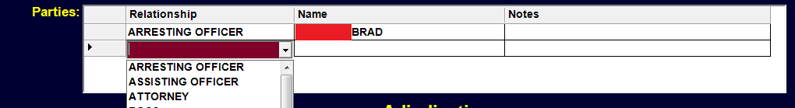

# Tables

The **Table** menu item may be used to change the displayed Data Table. 

**Data Tables** include Cases, Warrants, Profiles, Bonds, Parking, etc. Clicking on **Tables** will reveal a Sub-Menu with various Table Categories which will in turn reveals another sub-menu from which the desired Data Table may be selected. Clicking (or pressing enter) on a given Menu Item will take you to the respective Data Table.

Holding the CTRL Key down while changing Tables will cause the Table to open up in a second window, allowing you to later return to your original Data Table.

### Cases Table

***ALERTS***  
In red the top. Calls attention to important facts such as YOUTHFUL OFFENDER, UNDER 18, UTC-6B, UTC-25, WARRANTS.

  
*Example of an alert*

***BASIC DEFENDENT INFORMATION***  
Shows name in larger, easier to see format. System ID Number links to Profile. Age is current age followed by age at time of offense (if different).

  
*Name, ID Number, Age*

***BASIC CASE INFORMATION***  
Shows Adjudication and Status from below. Case Events are from the Events Data Grid. Each Event type and may be customized to determine which events are repeated here.

  
*Adjucation, status, case number, events*

***DEFENDANT NAME DROP DOWN FIELD***  
The name of the Defendant for this case. Pressing F4 or clicking on the downarrow will allow changing the name to another profile. As you start typing the display will change to that part of the Profile. You may at any point select a name.

  
*Name dropdown*

By simply typing in a 7 digit AL Drivers License Number or a state code and DL Number (TX17034568), a search will be launched to locate that Profile. If no Profile is found, you may do a right click to select 'Create New Profile' or type CTRL-N to start the process of creating a new Profile. You may Browse the Current Profile by pressing Ctrl-B.

  
*Search for defendent by license number*

***CASE TYPE, CASE NUMBER***  
You may create your own case types in the 'Case Types' Table located under the 'Lookup Menu'. The case number will be auto generated if you leave it blank. If this is manual entry (you are entering an old case and do not want to use the next number in series), you may type in the appropriate case number. To reset the next number in the series go to 'Number Series' Table under the 'Lookup Menu'.

  
*TR - Traffic, MC - Misdemeanor, etc.*

***COURT DATE AND TIME***  
The Court Date and Time may be entered or you may click on the 'D' for Date and see of list of valid Court Dates, Times and Types. The Dates must have been previously entered in the 'Court Dates' Table under the Case Menu. There is an option available to force any Court Date to firstbe in the 'Court Dates' Table OR you may chose to allow any valid date entered. (See also DATE FIELD item in this manual in FIELD TYPES section.)

  
*Court date and time*

***ORIGINAL COURT DATE***  
Should the current court date change you may optionally store the original date here.

  
*CASE STATUS CODE OPEN, CLOSED, HELD also displayed at top*

***DOCKET TYPE***  
An optional docket type for the given court date and time. You may create your own 'Docket types' in the Docket Type Table under the Case Menu. Dockets may then be create for just that Type.

  
*Docket type drop down*

***DATE ARRESTED, DATE FILED, DATE CASE CLOSED***  

***UTC NUMBER, WARRANT NUMBER, POLICE CASE NUMBER***  
UTC Number must be a Letter followed by 7 digits or a space and 7 digits.(M7914992 or M 7914992). Warrant # must be a valid warrant for the givenDefendant. Warrant Numbers are a two digit year, dash, and a 9 digit number.08-100 may be entered for 08-000000100. All warrants for the given defendantmay be viewed by pressing F4 on the Warrant # field or by clicking on the downarrow. Any warrant placed in a new MC record will be marked as EXECUTEDupon the saving of that record. You may Browse the warrant in this field by typingCtrl-B or by selecting Browse off the menu that appears upon right clicking onthis field. Police # is for any optional reference.

  
*UTC Number, Warrant Number and Police Case Number fields*

***CHARGE***  
Charges are listed in the 'Charges' Table in the Case Menu. The charge list maybe viewed by pressing F4 or clicking on the down arrow. The drop down list will adjust to what is being typed in the field. Alternatively, you may type in the DPSNumber or the State Statute. The Number '1' or '32-5A-171' would both bringin the 'SPEEDING' charge. You may also simply type the first few letters of thecharge (enough to make it unique) to bring that charge in. 'SP' would bring inSPEEDING. 'ME' would bring in 'MENANCING'.

  
*Charge drop down*

The Statute, Paragraph, Code and Local Ordinance will all be brought overwith the selected Charge.

  

If the selected charge is not payablethe 'Appearance Required' box will be checked. You have the option to check or uncheck the box as needed.

Various category boxes will be checked or unchecked based on the charge. You may alter these as needed. These boxes are used for reporting and setting up finesand costs.

On View may be checked for reporting purposes if this case is the result of an On View arrest.

***LOCAL AND STATE INFORMATION***  

Displays the total number of Cases in this local courtthat are open. Total Owed is the amount owed on local,adjudicated cases. Pending cases are not yet included.Warrants: displays the total number of Outstandingwarrants in this court.

  
*Local and state information*

State Information will be display only if there is an internetconnection and the state is providing this information. Profile: 1 signifies that there is demographic information available on this Defendant. History shows the number of entries that are to be viewed and may be more than the total number of cases from other courts. (Other Administrative Events are listed and counted. All this Defendant information may be viewed by clicking on the icon below.

  
*Defendent Information icon*

***Violations***  
For manually entering the total number of Traffic Violations for a given period which may affect whether or not an Appearance is required. Current DUI #: is manually entered and may affect the fines and costs or determineif the DUI is a felony. BAC - Blood Alcohol Content Test Result. Commerial and Haz Material are assumed to be False or 'N' unless a 'Y' is actually entered.

  

If the Charge is Altered or Amended, the Original Charge may be referenced here.Location: is the Violation Location and may be entered if desired.

Cases may be optionally excluded from the Docket or the Officer may not berequired to appear in court.

The Date the Defendant actually failed to appear. (Notthe date the FTA notice was sent.)

Click this button to create a new entry in the Party Data Grid.A Party is any Person(Profile) attached to this case. Relationshipidentifies how (or why) the person is involved in the case. Some Relationships include'Arresting Officer', 'Assisting Officer', 'Attorney', 'Complainant', 'Surety', etc.The relationship list is viewed by pressing F4 or clicking on the down arrow. You may create your own custom relationships in the 'Party Relationship' under the Lookup Menu.

Typing just a few letters in the relationship field will make the closest match. 'Arr' will produce 'Arresting Officer'. What is displayed in the Name field is determined by theRelationship Field. 'Arresting Officer', 'Assisting Officer', 'Probation Officer'must all be listed in the 'Officers' Table on the Parties Menus. Typing in a badge number should display that Officer. Most relationships (Such as 'Complainant' )only require having a Profile Record. You may go to the actual "Relationship' recordbeing displayed on this Data Grid by typing 'Ctrl-B' or Right Clicking on therelationship and chosing 'Browse' from the menu or by Double Left Clicking to thefar left of the particular row on the Data Grid. This Relationship Record also containsSubpoena information.

***ADJUDICATION FIELDS***  
There should be one possible Adjudication for each case (GUILTY, NOT GUILTY,NOL PROS, DISMISSED, or YO GUILTY) with one possible Appealed Adjudication.Other check boxes may be optionally checked such as Deferred Prosecution (sometimesreferred to as 'Diversion'), Probation Services, Youthful Offender (you may checkYouthful Offender for any of the adjudications.), or Driving School. If the case isAppealed, the date it was Appealed should be entered. Later there should be anAppeal Adjudication and an Appeal Adjudication Date. Should the case be remandedback, there is a check box to signify this.

***EVENTS***  
The Events Data Grid works very similar to the Parties Data Grid above. An eventis anything related to the case. The Event List comes from the 'Case Event Codes' Table in the Case Menu. You may create any Event Title you wish. The possibilitiesare limitless. Events are listed from the Most Recent Backwards. You may enter events by pressing the Add Event button. Some Events are automatically entered.(upon printing particular forms, for example). If more events are present than areable to be displayed, you may have to use scroll bars on the right to scroll down andview older events.

***UTC SUSPENSION NOTICES***  
While Suspension and Clearance Notices could have been placed in the event datagrid above, they were purposely separated out to allow for possible future transferfeatures. These fields are automatically filled with dates when the particular formis printed.

***CASE NOTES***  
Anything you wish to type may be placed here. Simple Notations are probably betterentered in the Event Data Grid with the 'Notation' Event.

***ADDITONAL REQUIREMENTS***  
Requirements in addition to Fines and Costs may be placed here. If the 'Case RemainsOpen' box is checked, the case will remain open even after it is paid off until a dateis entered in the 'Completed' field. Your requirements List comes from the 'CaseRequirement Codes' on the 'Case Menu'

***JUDGES ORDERS***  
Judges Orders follows the flow of the Case Action Summary. While Plea andDisposition are Drop Down Fields you may type 1 letter shortcuts such as'G' for Guilty and 'N' for Not Guilty. Since Case Action Summaries are normallyprinted prior to the Judges Orders, it is optional as to whether this information isentered here.

***BENCH NOTES***  
Any Bench Notes may be entered here. Clicking on the 'B' brings up a listing ofcommon Bench Notes used. This is useful if you have a lot of repeat Bench Notes.The list comes from the 'Bench Notes' Table under the 'Case Menu'. You maytype in Shortcuts for these 'Bench Notes'.

'Do Not Submit' is placed here for future Possible use. 'Manul Entry' is checked if you entered the Case Number yourself. (The system to generate the Case Number)

